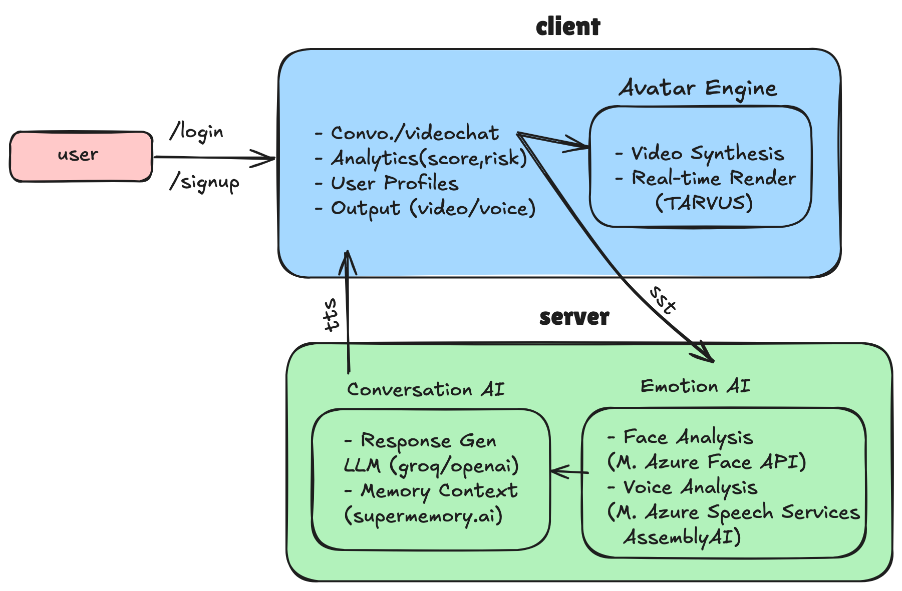

<h1>
    <span style="color:#27ae60;">zeo.ai </span>: Emotion-Aware AI for Mental Health
</h1>

**Shaping new frontiers in mental health support with human-like conversations powered by emotion (facial + vocal) recognition and AI intelligent avatars.**

[](https://opensource.org/licenses/MIT)
[](https://vitejs.dev/)
[](https://reactjs.org/)
[](https://www.typescriptlang.org/)

---


## 🧠 Project Overview

**zeo.ai** is an emotion-aware AI companion designed to provide 24/7, personalized mental health support. By combining real-time facial and vocal emotion recognition with advanced conversational AI and lifelike avatars, zeo.ai delivers authentic, empathetic, and human-like support—bridging the gap left by traditional and text-only AI solutions.

---

## 🚩 Problem Statement

- Over 1 billion people globally suffer from mental health disorders, with limited access to affordable, stigma-free support.
- 70% avoid seeking help due to stigma, cost, or lack of access.
- Existing AI tools (Woebot, Wysa) are text-only, missing 93% of human emotional cues (facial/vocal).
- Mental health professionals cannot provide 24/7 support, leaving critical gaps in care.

---

## 💡 The zeo.ai Solution

- **Emotion-Aware AI Companion:** Listens, watches, and understands users in real time, adapting to their emotions for truly empathetic support.
- **Interactive Video Avatars:** AI-driven avatars respond with adaptive tone, deep empathy, and realistic expressions.
- **Real-Time Emotion Recognition:** Advanced speech-to-text (STT), facial/vocal emotion detection (stress, sadness, joy), and contextual analysis.
- **LLM Response Generation:** Human-like text-to-speech (TTS) and STT for natural dialogue, with lifelike lip-sync and dynamic avatar expressions.

## 🛠️ Technical Stack

### Frontend
- **Framework**: React 18 with TypeScript
- **Build Tool**: Vite 4
- **Styling**: Tailwind CSS
- **State Management**: React Context API
- **Animation**: Framer Motion
- **Icons**: Lucide React
- **HTTP Client**: Axios

### Backend
- **Runtime**: Node.js
- **Framework**: Express.js
- **API Documentation**: OpenAPI/Swagger
- **Rate Limiting**: express-rate-limit
- **Security**: CORS, Environment-based configuration

### AI & Integrations
- **Avatar & Video**: Tavus API
- **Emotion Recognition**: Custom implementation (future)
- **Speech-to-Text**: Web Speech API (browser-native)

---

## 🏗️ System Architecture & Tech Stack

<p allign="center">
  
</p>

**Frontend:** React.js, TypeScript, TailwindCSS, JavaScript  
**Backend:** Node.js, Express.js, Python (ML, APIs)  
**Databases:** MongoDB / PostgreSQL  
**Microservices:**
- Face Analysis: Microsoft Azure Face API
- Voice Analysis: Microsoft Speech Services
- Speech Recognition (STT): Deepgram / Google STT
- Speech Synthesis (TTS): Eleven Labs TTS
- Avatar/Character: Tavus
- LLM: Groq/OpenAI
- Memory Context: Supermemory.ai

---

## 🌍 Social Impact & Vision

- Directly addresses UN SDG 3 (Good Health & Well-being) by making mental healthcare universally accessible and affordable.
- Early detection and crisis prevention through empathetic, always-available AI.
- Multi-modal emotion datasets, contextual memory, and predictive modeling for proactive support.
- Quantum-ready, scalable cloud infrastructure for future-proof AI.

---

## 📊 Market Validation & Competitive Advantage

- 970M+ people affected by mental health disorders (WHO 2024).
- 76% of Gen-Z need support, only 34% access it (McKinsey 2024).
- zeo.ai is the only solution combining real-time emotion recognition, video avatars, and mental health expertise.
- Dual-mode: Professional mental health + casual companionship.
- Crisis intervention protocols with human escalation.

---

## 🆚 Competitive Landscape

| Platform         | Emotion Recognition | Video Avatar | Empathetic Conversation | Crisis Protocol |
|------------------|--------------------|--------------|------------------------|-----------------|
| **zeo.ai**       | ✅                  | ✅            | ✅                      | ✅               |
| Character.AI     | ❌                  | ❌            | ⚠️ (text only)          | ❌               |
| Replika          | ❌                  | ❌            | ⚠️ (limited)            | ❌               |
| Woebot/Wysa      | ❌                  | ❌            | ⚠️ (clinical, text)     | ❌               |
| Tavus/Synthesia  | ❌                  | ✅            | ❌                      | ❌               |

---

## 🚀 Quick Start

### Prerequisites
- Node.js 16+ and npm 8+
- Tavus API Key (get one from [Tavus](https://www.tavus.io/))

### Setup & Installation

1. **Clone the repository**
   ```bash
   git clone https://github.com/yourusername/zeo.ai.git
   cd zeo.ai
   ```

2. **Install dependencies**
   ```bash
   # Install frontend dependencies
   npm install
   
   # Install backend dependencies
   cd server
   npm i
   cd ..
   cd client
   npm i
   ```

3. **Configure environment variables**
   - Frontend: Create `.env` file in the root directory
     ```
     VITE_API_BASE_URL=http://localhost:3001/api
     VITE_TAVUS_REPLICA_ID=r6ae5b6efc9d
     VITE_ENABLE_TAVUS=true
     VITE_ENABLE_AUTH=false
     ```
   - Backend: Create `.env` file in the `backend` directory
     ```
     PORT=3001
     NODE_ENV=development
     TAVUS_API_KEY=your_tavus_api_key
     TAVUS_API_URL=https://tavusapi.com/v2
     TAVUS_REPLICA_ID=r6ae5b6efc9d
     ```

4. **Start the development servers**
   - In one terminal (backend):
     ```bash
     npm start
     ```
   - In another terminal (frontend):
     ```bash
     npm run dev
     ```

5. **Open the app**
   - Frontend: http://localhost:8080
   - Backend API: http://localhost:3001/api

---

## 🛠️ Usage

- Launch the app and interact with the AI avatar for real-time, emotion-aware support.
- Explore features like video chat, emotion tracking, and personalized mental health insights.

---

## 🤝 Contributing

We welcome contributions! Please open issues, submit pull requests, or join our discussions to help make zeo.ai even better.

---

## 👥 Team: KANYARASHI

- **Surya Ganesh Yadala** (Full Stack Developer)
- **Sandeep Mopuri** (Backend Developer)
- **Dharma Teja Pola** (Product Builder & AI Developer)

*Winners @ World’s Largest AI Hackathon - Raise Your Hack*

---

## 📄 License

This project is licensed under the MIT License.

---

